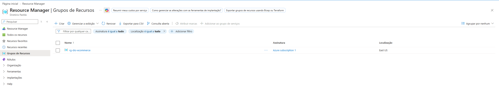
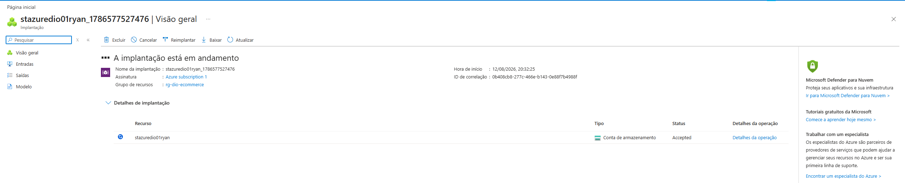
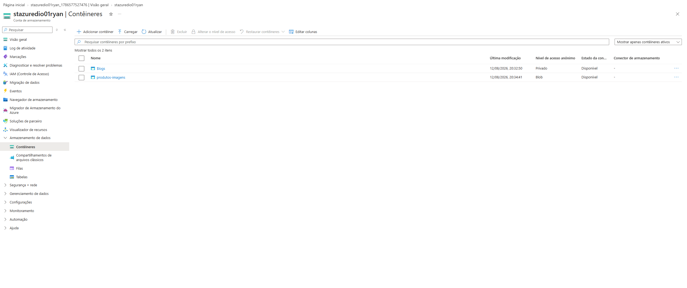
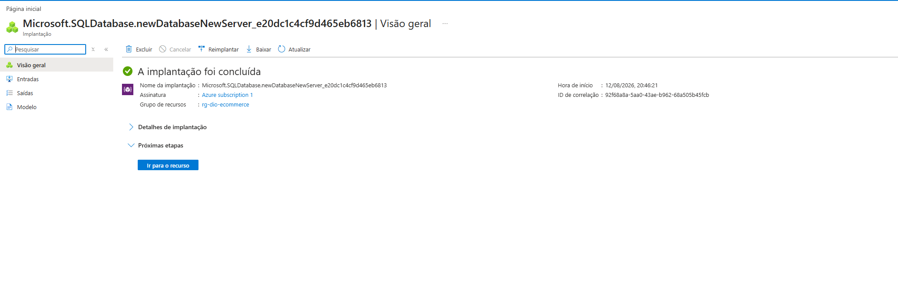
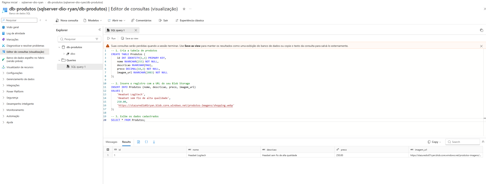

# Provisionamento de Infraestrutura no Microsoft Azure (DIO)

Este repositório contém os scripts e evidências do laboratório prático de provisionamento de recursos no Microsoft Azure.

---

## 📸 Evidências de Implantação

### 1. Criando o Grupo de Recursos
Criação do grupo de recursos `rg-dio-ecommerce` na região East US.



---

### 2. Implantação da Conta de Armazenamento
Criando a conta de armazenamento `stazuredio01ryan` no Azure.



---

### 3. Configuração do Contêiner Blob Storage
Criação do contêiner `produtos-imagens` com nível de acesso anônimo configurado como **Blob**.



---

### 4. Implantação do Banco de Dados Azure SQL
Criação e provisionamento do servidor e do banco de dados `db-produtos`.



---

### 5. Execução do Script SQL e Integração
Criação da tabela `Produtos`, inserção do registro apontando para a URL do Blob Storage e consulta `SELECT` validada com sucesso.



---

## 🛠️ Script SQL Utilizado

```sql
CREATE TABLE Produtos (
    id INT IDENTITY(1,1) PRIMARY KEY,
    nome NVARCHAR(255) NOT NULL,
    descricao NVARCHAR(MAX),
    preco DECIMAL(18,2) NOT NULL,
    imagem_url NVARCHAR(2083) NOT NULL
);

INSERT INTO Produtos (nome, descricao, preco, imagem_url)
VALUES (
    'Headset Logitech', 
    'Headset sem fio de alta qualidade', 
    250.00, 
    '[https://stazuredio01ryan.blob.core.windows.net/produtos-imagens/shopping.webp](https://stazuredio01ryan.blob.core.windows.net/produtos-imagens/shopping.webp)'
);

SELECT * FROM Produtos;